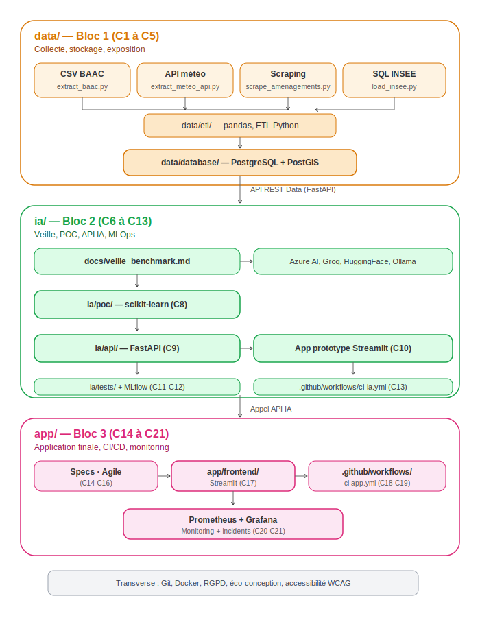

# Architecture technique — PrediBike

## Contexte et objectif

PrediBike n'est pas une plateforme grand public, mais une **application
d'aide à la décision budgétaire** destinée aux communes de la région
Rhône-Alpes. Elle s'appuie sur la prédiction du risque d'accident vélo,
calculée à partir de l'historique des accidents corporels recensés en
France depuis 2005 (base BAAC).

L'objectif final n'est pas seulement d'informer un usager individuel, mais
d'outiller les collectivités dans leurs **arbitrages d'investissement** :
estimer le risque d'une zone permet d'objectiver une demande de travaux
(création de piste cyclable, zone 30, signalétique) et d'aider à prioriser
les demandes adressées à la région lorsque les budgets disponibles sont
limités. L'application se positionne donc comme **un composant dans une
chaîne de prise de décision**, en amont de la validation des projets et
des budgets — elle ne remplace pas la décision politique ou technique,
elle fournit un élément d'objectivation supplémentaire.

Concrètement, l'application permet à un utilisateur (technicien de
collectivité, élu, ou cycliste) de saisir un lieu et d'obtenir :

1. Un score de risque estimé pour ce lieu, selon les conditions actuelles
2. Des recommandations d'aménagement cyclable lorsque le risque est élevé,
   utilisables comme argumentaire dans une demande budgétaire

Le modèle raisonne **au niveau de l'accident** (et non de l'usager individuel),
ce qui permet de produire un score de risque par zone géographique et
conditions, réutilisable au-delà du seul historique français.

Cette orientation "aide à la décision" renforce une exigence déjà présente
dans la conception du modèle : la **priorité donnée à l'interprétabilité**
(scikit-learn plutôt qu'un modèle boîte noire) n'est pas qu'un choix
technique, c'est une nécessité fonctionnelle — un technicien ou un élu doit
pouvoir comprendre et défendre *pourquoi* un score de risque justifie une
dépense, face à d'autres priorités budgétaires concurrentes.

## Vue d'ensemble

Le projet est structuré en trois blocs, conformes au référentiel de
certification, et reflétés directement dans l'arborescence du dépôt Git :

| Bloc référentiel | Compétences | Dossier du repo |
|---|---|---|
| Bloc 1 — Données | C1 à C5 | `data/` |
| Bloc 2 — Service IA | C6 à C13 | `ia/` |
| Bloc 3 — Application | C14 à C21 | `app/` |

## Bloc 1 — Données (`data/`)

### Les 4 sources de données

| Source | Type imposé | Contenu | Outil de collecte |
|---|---|---|---|
| CSV BAAC (Caractéristiques, Lieux, Véhicules) | Fichier | Historique accidents 2005-2024 | pandas |
| API météo (Météo-France / OpenWeather) | API REST publique | Conditions météo au lieu/moment de l'accident | requests |
| Sites municipaux (zones 30, aménagements) | Scraping web | Contexte infrastructure cyclable | BeautifulSoup4 |
| Données communales INSEE | Base SQL | Population, superficie par commune | pandas → import SQL |

### Pipeline

1. Extraction brute de chaque source (`data/etl/extract_*.py`, `scrape_*.py`, `load_insee.py`)
2. Nettoyage et agrégation au niveau accident (calcul des compteurs véhicules,
   jointures sur l'identifiant accident et le code commune)
3. Chargement dans une base PostgreSQL avec extension PostGIS
   (`data/database/mpd_predibike.sql`)
4. Exposition via une API REST documentée (`data/api/`, FastAPI + Swagger)

### Choix techniques justifiés

- **PostgreSQL + PostGIS** plutôt que MySQL/SQLite : le projet manipule des
  coordonnées GPS et nécessite des requêtes de proximité géographique
  (ex. "aménagement cyclable à moins de 200m d'un point") — PostGIS fournit
  le type `GEOGRAPHY` et les fonctions spatiales natives (`ST_DWithin`)
  nécessaires, sans recalcul trigonométrique manuel.
- **FastAPI** : cohérence avec l'écosystème Python data/ML du projet,
  documentation Swagger générée automatiquement (exigence "API documentée").

## Bloc 2 — Service IA (`ia/`)

### Démarche

1. **Veille technique** (`docs/veille_benchmark.md`) : exploration des
   services IA existants (Azure AI Services, Groq, HuggingFace, Ollama).
   Conclusion attendue : aucun service généraliste ne couvre la prédiction
   de risque accident vélo — justifie la construction d'un modèle dédié.
2. **POC** (`ia/poc/`) : modèle scikit-learn (Random Forest / XGBoost) entraîné
   sur les features agrégées au niveau accident (lieu, météo, densité
   commune, présence d'aménagement à proximité).
3. **API REST IA** (`ia/api/`) : expose le modèle entraîné, sécurisée,
   avec un endpoint de prédiction acceptant des coordonnées en entrée.
4. **App prototype** : interface Streamlit légère pour tester le modèle
   avant intégration dans l'application finale.
5. **MLOps** : suivi des expérimentations et versions de modèle avec
   MLflow, tests automatisés (Pytest), pipeline CI/CD (GitHub Actions, Docker).

### Versionnement automatisé — semantic-release

L'ensemble du dépôt (data, ia, app) adopte **semantic-release**, intégré à
la pipeline GitHub Actions. Principe :

- Les messages de commit suivent la convention
  [Conventional Commits](https://www.conventionalcommits.org/)
  (`feat:`, `fix:`, `docs:`, `BREAKING CHANGE:`...)
- À chaque merge sur la branche principale, semantic-release détermine
  automatiquement le numéro de version suivant (majeure / mineure / patch)
  selon la nature des commits accumulés
- Le `CHANGELOG.md` et le tag Git de version sont générés automatiquement,
  sans intervention manuelle

Justification de ce choix pour le projet : au-delà de l'exigence de
documentation du référentiel, un historique de version clair et fiable
est particulièrement pertinent pour un outil destiné à appuyer des
décisions budgétaires — une collectivité doit pouvoir identifier
précisément quelle version du modèle ou de l'application a produit telle
recommandation, en particulier si le modèle est réentraîné ou ajusté dans
le temps.

### Choix techniques justifiés

- **scikit-learn plutôt qu'un LLM/service externe** : le problème est une
  classification/régression sur données tabulaires structurées — un modèle
  de ML classique est plus performant, plus interprétable (utile pour
  justifier une recommandation au jury et à l'utilisateur) et plus léger
  (cohérent avec la contrainte d'éco-conception) qu'un grand modèle de
  langage pour ce cas d'usage.
- **MLflow** : permet de tracer les versions du modèle et leurs métriques
  dans le temps, nécessaire pour le monitoring exigé (C11).

## Bloc 3 — Application (`app/`)

### Fonctionnement

L'utilisateur saisit un lieu (ou le sélectionne sur une carte). L'application :

1. Interroge l'API Data pour le contexte (commune, historique local)
2. Interroge l'API IA pour le score de risque prédit
3. Calcule dynamiquement (requête spatiale) les aménagements cyclables
   à proximité
4. Compare risque prédit et aménagement existant pour formuler une
   recommandation (ex. construction de piste, signalétique, réduction
   de vitesse)

### Choix techniques justifiés

- **Streamlit** : cohérent avec la stack imposée par le référentiel,
  permet un développement rapide d'interface data-centrée sans
  complexité front-end superflue.
- **Accessibilité (WCAG)** : la carte de risque n'utilise pas uniquement
  un code couleur rouge/vert (problématique pour les daltoniens) — un
  motif ou une icône complète l'information visuelle.

## Schéma d'architecture



Flux général :

```
[CSV BAAC] [API météo] [Scraping] [SQL INSEE]
        \      |           |        /
         \     |           |       /
          data/etl/ (pandas, nettoyage, agrégation)
                      |
          data/database/ (PostgreSQL + PostGIS)
                      |
          data/api/ (FastAPI — API REST Data)
                      |
          ia/poc/ → ia/api/ (FastAPI — API REST IA)
                      |
          app/frontend/ (Streamlit)
                      |
              Utilisateur final
```

Transverse à tous les blocs : Git/GitHub, Docker, RGPD (registre des
traitements), éco-conception, accessibilité WCAG, CI/CD (GitHub Actions),
versionnement automatisé (semantic-release), monitoring (Prometheus/Grafana).

## RGPD — Principe général

Aucune donnée personnelle identifiante n'est conservée : les données BAAC
sont déjà anonymisées à la source, et le modèle raisonne au niveau accident
(agrégats), jamais au niveau individu. Voir `docs/rgpd_registre.md` pour le
registre des traitements détaillé.

## Éco-conception — Principe général

- Modèle ML léger (scikit-learn) plutôt qu'un grand modèle de langage,
  pour un coût de calcul et un impact environnemental réduits à l'inférence.
- Agrégation des données au niveau accident plutôt qu'au niveau usager,
  réduisant le volume de données stockées et traitées sans perte
  d'information utile à l'objectif du projet.
