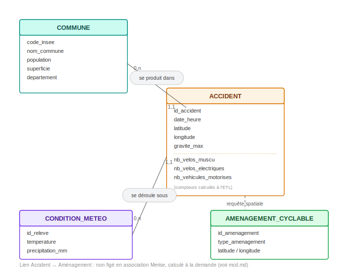

# Modèle Conceptuel des Données (MCD) — PrediBike

## Démarche et granularité retenue

Le MCD modélise les entités métier et leurs relations, indépendamment de
toute technologie de stockage.

**Choix de granularité : niveau accident.** Le fichier source BAAC est
nativement structuré au niveau usager (une ligne par personne impliquée).
Le modèle de prédiction visé ici raisonne au niveau "lieu × conditions",
dans une logique de cartographie du risque et de recommandation
d'aménagement plutôt que d'analyse de profils individuels. Ce choix rend
également le modèle plus généralisable à d'autres contextes géographiques,
là où un modèle appris sur des profils d'usagers serait plus spécifique à
l'historique français.

Conséquence directe sur la modélisation : les entités `USAGER` et
`VEHICULE`, bien que présentes dans les données sources, ne sont **pas**
représentées comme des entités séparées dans ce MCD. Leur information utile
est absorbée sous forme d'attributs agrégés (compteurs) directement sur
l'entité `ACCIDENT`, calculés lors de l'ETL à partir des fichiers source
"Véhicules" et "Usagers".

## Entités

### ACCIDENT

Entité centrale du modèle. Une occurrence = un accident corporel impliquant
au moins un vélo.

| Attribut | Description |
|---|---|
| id_accident | Identifiant unique (repris de l'identifiant officiel BAAC) |
| date_heure | Date et heure de l'accident |
| latitude / longitude | Localisation géographique |
| gravite_max | Gravité la plus élevée constatée parmi les usagers impliqués |
| nb_velos_muscu | Nombre de vélos non motorisés impliqués |
| nb_velos_electriques | Nombre de vélos à assistance électrique impliqués |
| nb_vehicules_motorises | Nombre de véhicules motorisés impliqués (voiture, moto, poids lourd confondus) |

Les trois derniers attributs sont calculés à l'ETL en comptant les lignes
du fichier source "Véhicules" partageant le même identifiant d'accident,
sans distinction fine au-delà de la catégorie vélo musculaire / vélo
électrique / motorisé — distinction jugée suffisante pour l'objectif du
projet.

### COMMUNE

| Attribut | Description |
|---|---|
| code_insee | Identifiant unique de la commune |
| nom_commune | Nom de la commune |
| population | Population de la commune (source INSEE) |
| superficie | Superficie en km² (source INSEE) |
| departement | Département de rattachement |

La superficie est conservée en complément de la population pour permettre
le calcul d'une densité (population / superficie), variable de contexte
pertinente pour distinguer un profil de risque urbain dense d'un profil
rural étendu.

### CONDITION_METEO

| Attribut | Description |
|---|---|
| id_releve | Identifiant unique du relevé |
| temperature | Température au moment de l'accident |
| precipitation_mm | Précipitations relevées |

### AMENAGEMENT_CYCLABLE

| Attribut | Description |
|---|---|
| id_amenagement | Identifiant unique |
| type_amenagement | Type d'infrastructure (piste séparée, bande cyclable, zone 30, voie verte) |
| latitude / longitude | Localisation géographique |

## Associations et cardinalités

### ACCIDENT — se produit dans — COMMUNE

- Un `ACCIDENT` se produit dans **1,1** `COMMUNE` (exactement une)
- Une `COMMUNE` est concernée par **0,n** `ACCIDENT` (aucun ou plusieurs)

### ACCIDENT — se déroule sous — CONDITION_METEO

- Un `ACCIDENT` se déroule sous **1,1** `CONDITION_METEO`
- Une `CONDITION_METEO` peut concerner **0,n** `ACCIDENT`

### ACCIDENT — AMENAGEMENT_CYCLABLE : pas d'association Merise classique

Ce lien n'est **volontairement pas représenté** comme une association
figée du MCD. Justification :

- Le besoin métier est de déterminer, **à tout moment**, si un aménagement
  cyclable se trouve à proximité d'un point géographique donné — que ce
  point soit un accident historique (pour l'entraînement du modèle) ou un
  nouveau lieu saisi par un utilisateur (pour une prédiction en temps réel).
- Les aménagements cyclables évoluent dans le temps indépendamment des
  accidents passés (une commune peut construire une piste après un
  accident) : figer ce lien à un instant donné produirait une information
  rapidement obsolète.
- Le rapprochement entre les deux entités est donc traité comme une
  **requête spatiale calculée à la demande** (distance géographique entre
  deux points), et non comme une relation stockée en base. Voir
  `mpd.md` pour l'implémentation technique (PostGIS, `ST_DWithin`).

## Schéma



Version texte équivalente :

```
COMMUNE (0,n) ←──── se produit dans ────→ (1,1) ACCIDENT
                                              ↑ (1,1)
                                              │ se déroule sous
                                              ↓ (0,n)
                                       CONDITION_METEO

ACCIDENT  ┄┄┄ requête spatiale (non figée) ┄┄┄  AMENAGEMENT_CYCLABLE
```
