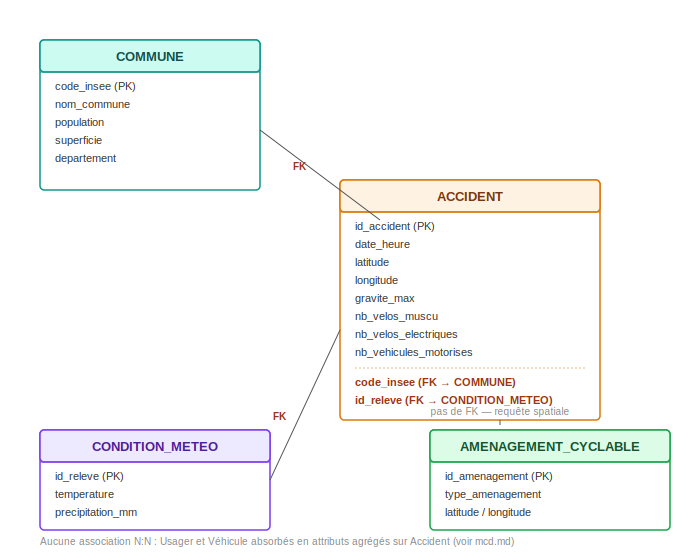

# Modèle Logique des Données (MLD) — PrediBike

## Principe de transformation MCD → MLD

Chaque entité du MCD devient une table. Les associations dont la
cardinalité est **1,1** d'un côté et **0,n** (ou 1,n) de l'autre se
traduisent par l'ajout d'une **clé étrangère du côté "1,1"** — c'est le
côté qui ne peut référencer qu'une seule occurrence de l'autre entité, et
qui peut donc stocker cette référence dans une colonne unique (principe de
1ère forme normale : une colonne ne contient qu'une seule valeur par ligne).

Aucune table de liaison n'est nécessaire ici : le modèle ne comporte pas
d'association plusieurs-vers-plusieurs (N:N), ce choix ayant été fait dès
le MCD en écartant les entités `USAGER` et `VEHICULE` au profit
d'attributs agrégés sur `ACCIDENT`.

## Tables

### COMMUNE

| Colonne | Clé |
|---|---|
| code_insee | PK |
| nom_commune | |
| population | |
| superficie | |
| departement | |

### CONDITION_METEO

| Colonne | Clé |
|---|---|
| id_releve | PK |
| temperature | |
| precipitation_mm | |

### AMENAGEMENT_CYCLABLE

| Colonne | Clé |
|---|---|
| id_amenagement | PK |
| type_amenagement | |
| latitude / longitude | |

Aucune clé étrangère vers `ACCIDENT` : conformément au choix justifié dans
`mcd.md`, le rapprochement entre les deux entités se fait par requête
spatiale à la demande, pas par une référence stockée.

### ACCIDENT

| Colonne | Clé |
|---|---|
| id_accident | PK |
| date_heure | |
| latitude / longitude | |
| gravite_max | |
| nb_velos_muscu | |
| nb_velos_electriques | |
| nb_vehicules_motorises | |
| code_insee | FK → COMMUNE(code_insee) |
| id_releve | FK → CONDITION_METEO(id_releve) |

## Schéma relationnel



Version texte équivalente :

```
COMMUNE (code_insee PK)
   ↑
   │ FK
   │
ACCIDENT (id_accident PK, code_insee FK, id_releve FK)
   │
   │ FK
   ↓
CONDITION_METEO (id_releve PK)

AMENAGEMENT_CYCLABLE (id_amenagement PK)  — pas de FK, lien spatial à la demande
```

## Pourquoi les clés étrangères sont portées par ACCIDENT et non l'inverse

Une erreur fréquente consiste à vouloir stocker, côté `COMMUNE`, une liste
des accidents qui s'y sont produits. Ce n'est pas possible dans un modèle
relationnel : une colonne ne peut contenir qu'une valeur unique par ligne,
jamais une liste (1ère forme normale). Comme un accident a exactement une
commune (cardinalité 1,1) alors qu'une commune peut avoir un nombre
variable d'accidents (cardinalité 0,n), c'est nécessairement la table du
côté "1,1" — ici `ACCIDENT` — qui porte la référence vers l'autre table.
La recherche inverse ("tous les accidents d'une commune") se fait par une
requête de filtrage (`WHERE code_insee = ...`), appuyée par un index sur
cette colonne plutôt que par une liste stockée.
